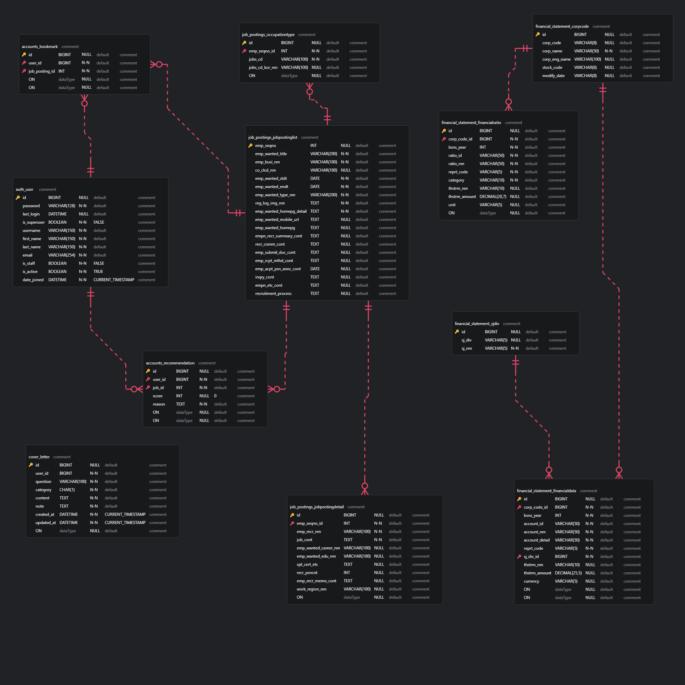

# Recruit Insight

## 프로젝트 개요

Recruit Insight는 재무제표 기반 기업 분석과 AI 추천을 결합한 올인원 채용 관리 플랫폼입니다. 단순 채용 공고 나열을 넘어, 공공 데이터를 활용한 기업 재무 분석과 LLM 기반 개인 맞춤형 추천을 제공하여 구직자가 보다 합리적인 의사결정을 할 수 있도록 돕는 것을 목표로 합니다.

---

## 실행 방법
1. 마이그레이션 진행
2. loaddata (recruit.json)
3. 백/프론트 서버 실행


## 핵심 가치 (Core Values)

- Trust: 재무 건전성과 성장성을 수치 기반으로 검증

- Insight: AI가 사용자 정보와 공고 맥락을 분석하여 매칭 점수와 추천 사유 제공

- Efficiency: 채용 공고 관리, 북마크, 이력서 및 자기소개서 관리를 하나의 플랫폼에서 통합 제공

---

## 프로젝트 정보

* 개발 기간: 2025.12.15 ~ 2025.12.26
* 팀 구성: 2인 (여희림, 양현서)
* 주요 목표
  * 공공 채용 데이터 수집 및 정규화
  * 재무비율 자동 산출 및 기업 점수화
  * 기업 검색, 추천 기능 제공

---

## 기술 스택

* Python 3.11
* Django 5.2.9, Django REST Framework
* SQLite
* Libraries
  - Backend / Framework
    - Django
    - django-cors-headers
    - djangorestframework
    - djangorestframework-simplejwt

  - 환경 변수 관리
    - python-dotenv

  - 데이터 수집 / 처리
    - xmltodict

  - AI / LLM
    - openai
    - langchain
    - langchain-openai
    - langgraph
    - langsmith

  - HTTP / 외부 API 통신
    - requests

  - 개발 도구 / 품질 관리
    - ruff
    - pre-commit

* Vue.js 3 (Composition API)
* Pinia
* CSS / Bootstrap


* Git, GitHub
* GitHub Actions (Ruff 기반 Lint 자동화)
* VS Code

---

## 팀원 정보 및 역할

- 파일 첨부

## 데이터 파이프라인 설계

### 데이터 수집

* DART, 고용24 API 수집
* xmltodict를 사용한 XML → Dictionary 변환

### 데이터 전처리

* 계정명, 연도, 기업 코드 기준 정규화
* 누락 데이터(None) 및 0 나눗셈 예외 처리
* 리스트 데이터 .join 활용하여 한 행으로 구성
---

## 재무 비율 분석 로직

### 분석 지표

* 유동성: 유동비율, 당좌비율, 현금비율
* 안정성: 부채비율, 자기자본비율
* 성장성: 총자본 증가율 (전년 대비)

### 계산 흐름

1. 재무제표 원장 데이터 조회
2. 항목별 금액 집계
3. 지표별 산식 적용
4. 정규화 및 연도별 비교

---

## 추천 알고리즘 개요

1. 기업 재무비율 산출
2. 지표별 점수 정규화
3. 카테고리 가중치 적용
4. 기업 종합 점수 계산
5. AI 결과 해석 생성

```text
기업 점수 = Σ(정규화 지표 × 가중치)
```
---

## 주요 기능
### 회원 관리
  - JWT 기반 회원가입, 로그인, 로그아웃
  - 회원 정보 수정 및 마이페이지 제공
### 데이터 관리
  - DART 재무제표 데이터 자동 수집 및 저장
  - 채용 공고 데이터 수집 및 관리
  - 사용자 활동 데이터 관리
### AI 추천
  - 사용자 이력 정보 기반 프롬프트 자동 생성
  - AI 응답 후처리 및 추천 사유 정제
  - 점수 기반 기업 추천 결과 제공
### 사용자 서비스 (기업 / 공채 정보)
  - 재무제표 기업 목록 및 검색
  - 기업별 재무제표 상세 조회 및 분석
  - 채용 공고 목록, 상세 조회 및 북마크
### 개인 맞춤 서비스
  - 자기소개서 CRUD 기능
---


## 데이터베이스 모델링 (ERD 개요)

- 파일 첨부(recruit_insight.erd)

---

## 기술적 도전 및 문제 해결

### 대용량 데이터 적재 성능 문제

* 문제: 반복적인 save 호출로 인한 성능 저하
* 해결: bulk_create 도입
* 결과: 적재 시간 약 80% 단축

### 외부 API(XML) 데이터 구조 불일치 문제
상황

* DART API 및 고용24 API 응답이 XML 기반
  * 기업/계정/연도에 따라 필드 구조가 달라짐
  * 동일 의미지만 필드명이 다름
  * 특정 연도 또는 기업에서 데이터 누락 발생
* 문제
  * 단순 파싱 시 KeyError, NoneType 오류 발생
  * 프론트 차트 렌더링 중 런타임 에러 발생
* 해결
  * xmltodict로 XML → dict 변환
  * 계정명 기준 탐색 로직 구현

### Git 협업 관리

* rebase 전략 도입으로 히스토리 단순화
* ruff 적용으로 코드 스타일 충돌 방지

---

## 문서 및 산출물

  - 기능 명세서
  - API 명세서
  - ERD 설계 문서
  - 회의록(github: https://github.com/HeHe985/Recruit-Insight/discussions/categories/%ED%9A%8C%EC%9D%98%EB%A1%9D)
  - 실행 화면 캡쳐 이미지

---

## 회고

본 프로젝트는 데이터 수집부터 분석, 추천까지 이어지는 전체 데이터 흐름을 직접 설계하고 구현한 경험이었습니다. 외부 공공 데이터와 내부 서비스 데이터를 결합하면서 데이터 무결성과 구조 설계의 중요성을 체감했으며, AI를 단순 기능이 아닌 해석 도구로 활용하는 방향에 대해 고민할 수 있었습니다. 또한 협업 과정에서 Git과 문서화의 중요성을 깊이 이해하는 계기가 되었습니다.